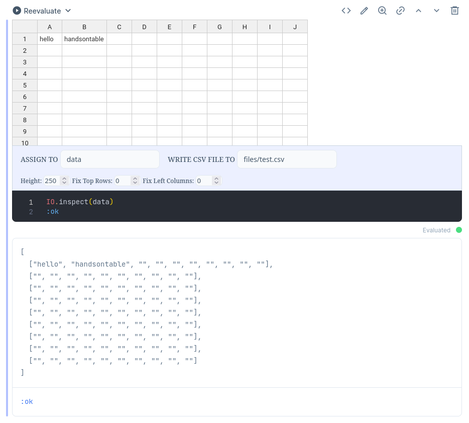
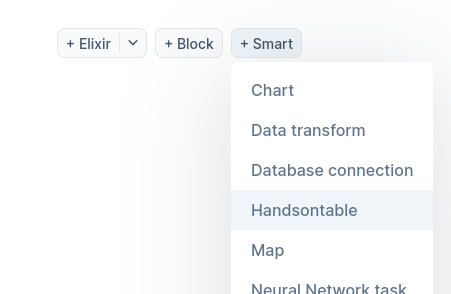

# Handsontable Kino Smartcell

use [Handsontable](https://handsontable.com/) to edit/enter data in [livebook](https://livebook.dev/) like excel/spreadsheet, created with livebook's [smart cell](https://hexdocs.pm/kino/Kino.SmartCell.html)



## Installation

Add these lines to `Notebook dependencies and setup` to install package and set config

```elixir
Mix.install([
  {:handsontable_kino_smartcell, git: "https://github.com/pastleo/handsontable_kino_smartcell.git", tag: "0.1.8"},
])

Application.put_all_env(
  handsontable: [
    license_key: "non-commercial-and-evaluation",
  ]
)
```

> about [Handsontable License key](https://handsontable.com/docs/javascript-data-grid/license-key/)

then you can add `Handsontable` in `+ Smart` list:



Documentation can be generated with [ExDoc](https://github.com/elixir-lang/ex_doc)
and published on [HexDocs](https://hexdocs.pm). Once published, the docs can
be found at <https://hexdocs.pm/handsontable_kino_smartcell>.

